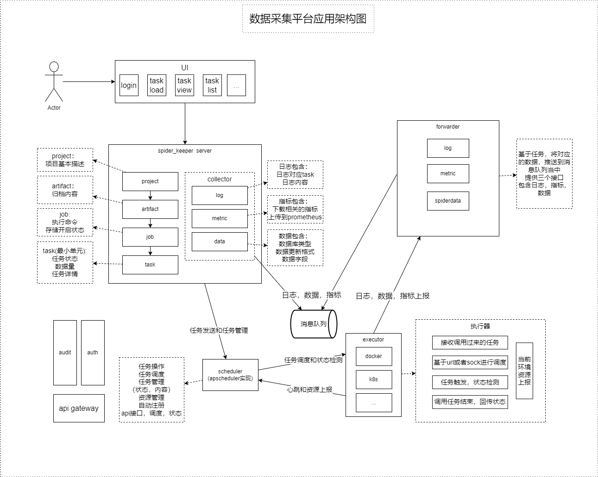

# 数据采集平台
数据采集平台是一个提供调度功能和数据收集存储一体的任务平台，旨在减少爬虫开发和运维过程的复杂度，
让开发人员更着重于爬虫设计和业务逻辑开发，不需关注数据的存储和任务的调度，将极大的减少项目的开发周期，
提高开发效率。  

## 架构设计图

## 系统功能描述
数据采集平台系统提供统一的web页面，用户通过页面选项进行项目的添加和任务触发操作，本系统分为5部分组成：  
* 核心服务模块
* 任务调度模块
* 执行器模块
* 转发器模块
* 前端页面

其中，核心服务模块包括任务的增删改查、任务触发、任务数据的收集和存储操作；调度器模块包括对任务调度状态的控制、执行器的管理，
实现任务灵活的调度功能；执行器模块主要提供docker、k8s等云原生的任务调度功能；转发器模块提供具体任务执行过程中的数据收集和
转发功能。  
系统提供完整的web页面管理功能，用户可通过页面进行任务的修改和数据的查看，及时准确获取任务的执行情况，直观性的展示数据存储量、
日志详情、任务指标。

## 系统功能点

### 当前版本

* 自定义任务调度
* 指标、日志、数据收集和保存
* 数据保存提供Mysql数据库支持
* 任务调度状态可视化展示
* 容器化的部署

### 后续版本

* 基于k8s平台的任务管理与部署
* 任务执行器的优化选取功能
* 爬虫数据持久化方案添加非关系型数据库、文件存储服务功能
* 任务指标展示
* 归档文件的动态生成
* 集成代理池服务，提供便捷式的代理需求
* 集成验证码服务，提供便捷式的验证码接入
* 用户认证和授权功能
* APM集成
* 日志存储

## 计划与里程碑
* 2023-01-13 v3.0发布
* 2023-02-28 v3.1发布，提供非关系型数据库、文件服务存储功能
* 2023-03-31 v3.2发布，云原生接入，提供k8s执行器功能，任务指标展示
* 2023-05-31 v4.0发布，认证与授权功能接入
* 2023-07-31 v4.1发布，APM与执行器动态选取功能
* 2023-10-31 v4.2发布，代理池服务集成
* 2023-11-30 v4.3发布，验证码服务集成