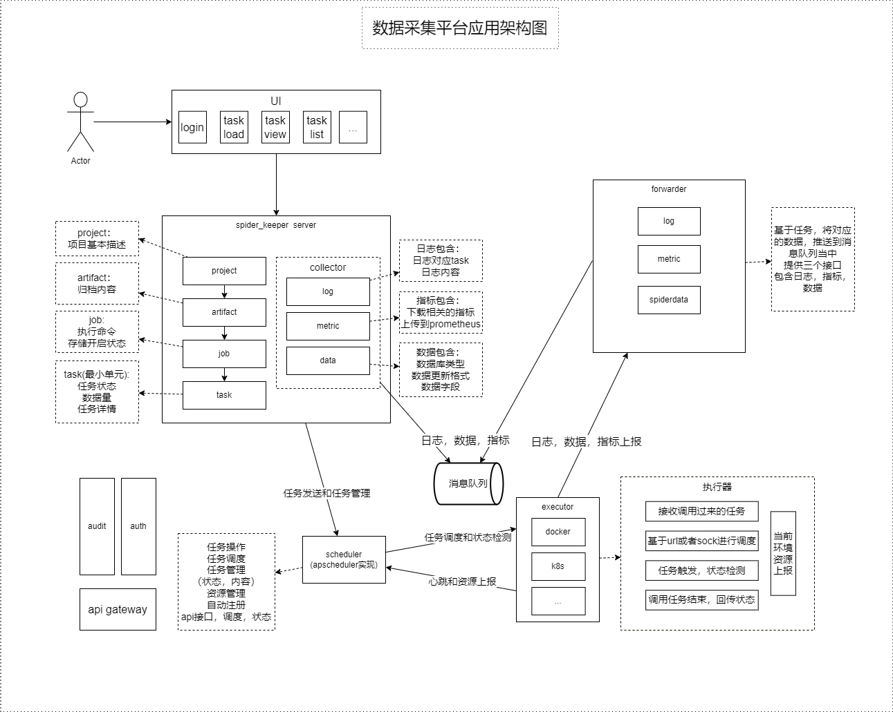

# 架构设计图

## 功能概述

数据采集平台系统提供统一的web页面，用户通过页面选项进行作业的添加和任务触发操作，
本系统分为6部分组成：

- 核心服务模块
    - 提供对外接口给web服务
    - 作业创建全流程
    - 日志、数据、监控收集功能
- 任务调度模块
    - 接收核心服务发送的任务
    - 调度服务
    - 执行器的管理
- 执行器模块
    - docker
    - k8s
- 转发器模块
    - 供采集程序调用的api
    - 日志、数据、监控转发
- 前端页面
    - 对外提供web页面
    - 任务管理流程
    - 执行器基本信息查看
- sdk（可选）
    - 采集程序接入库
    - 收集日志、数据、监控并发送到转发器
