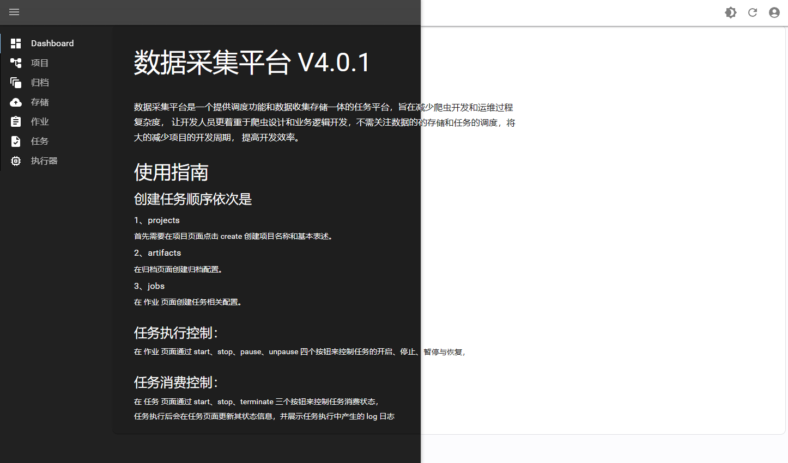

# 欢迎来到数据采集平台

## 什么是数据采集平台？

数据采集平台是一款提供调度功能和数据收集存储一体的任务平台，旨在减少爬虫开发和运维过程的复杂度，
让开发人员更着重于爬虫设计和业务逻辑开发，不需关注数据的存储和任务的调度，将极大的减少项目的开发周期，
提高开发效率。

您可以将现有的数据采集项目接入到采集平台当中，以获取采集平台的所有功能，更为高效便捷的管理采集任务。

## 背景

现有的采集框架或者调度框架，比如scrapy，专注于采集，比如airflow，专注于调度，业内对采集和调度融于一体的项目
少之又少，使用多数框架开发的任务，需基于主机环境进行部署，灵活性不高，且数据存储、可视化较为单一。
在当下大数据环境下，各种新技术、新框架层出不穷，用户对采集程序的可视化、数据存储有了更高地要求。

## 目标

为了提供一款集成与采集、调度、数据存储和可视化于一体的解决方案，故衍生出数据采集平台项目，鉴于当下云原生容器化的突出表现，
用户仅需要将采集项目构建成镜像，通过web页面进行配置，便可部署到指定的平台中。

## 组件

数据采集平台提供以下内容：

- UI 管理界面，用来创建和查看任务
- sdk 提供采集项目接入采集平台的包

## 安装

请参阅[Docker-compose](./installation/compose.md)或者[kubernetes](./installation/k8s.md)中的安装步骤。

## 部分截图

采集平台管理界面提供浅色和深色模式。

