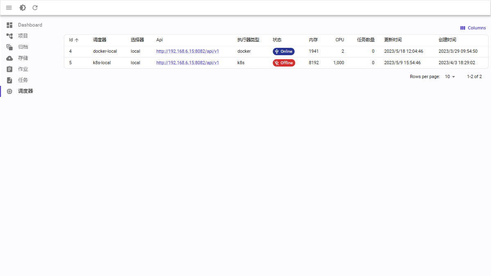

# 快速开始

## Dashboard

点击左侧“Dashboard”菜单按钮，右侧展示Dashboard详细描述信息。

登录系统后，默认在当前页面，左侧边栏包含：Dashboard、项目、归档、存储、作业、任务、调度器共7个菜单。

## 项目管理

点击“项目”菜单，进入项目管理界面。

### 查看项目

页面包含Create（创建）按钮、Columns（列筛选）按钮以及项目列表信息。

其中 Columns按钮用来控制展示字段（下同）。

### 创建项目

点击“Create” 按钮，进入创建页面界面，填写相关信息，点击”SAVE” 按钮，完成数据保存，页面跳转。

### 编辑项目

点击项目所在行，进入选定项目编辑页面，页面包含 “SAVE”（保存）和”DELETE”（删除）按钮。
修改项目内容后，点击”SAVE”按钮，完成编辑项目功能。

### 删除项目

点击列表页”DELETE”按钮，完成所选项目的删除操作

## 归档管理

点击“归档”菜单，进入归档管理界面。

### 查看归档

页面包含Create（创建）按钮、Columns（列筛选）按钮以及归档列表信息。

### 归档创建

点击“Create” 按钮，进入创建归档界面，填写相关信息。点击“SAVE” 按钮，完成数据保存，页面跳转。

### 编辑归档

点击归档所在行，进入选定归档编辑页面，页面包含 “SAVE”（保存）和”DELETE”（删除）按钮。
修改归档内容后，点击”SAVE”按钮，完成编辑归档功能。

### 删除归档

点击”DELETE”按钮，完成所选归档的删除操作。

## 存储管理

点击“存储”菜单，进入存储管理界面。

### 查看存储

页面包含Create（创建）按钮、Columns（列筛选）按钮以及存储列表信息。

### 创建存储

点击 “Create” 按钮，进入创建存储界面，填写相关信息。
点击 “SAVE” 按钮，完成数据保存，页面跳转。

### 编辑存储

点击存储所在行，进入选定存储查看页面，页面包含“Edit”（编辑）按钮。

点击编辑按钮后进入存储编辑页面，页面包含 “SAVE”（保存）和”DELETE”（删除）按钮。
修改归档内容后，点击”SAVE”按钮，完成编辑存储功能。

### 删除存储

点击”DELETE”按钮，完成所选存储的删除操作。

## 作业管理

点击“作业”菜单，进入作业管理界面。

### 查看作业

页面包含Create（创建）按钮、Columns（列筛选）按钮以及作业列表信息

### 创建作业

点击“Create” 按钮，进入创建作业界面，填写相关信息。
点击“SAVE” 按钮，完成数据保存，页面跳转。

### 编辑作业

点击作业所在行，进入选定作业编辑页面，页面包含 “SAVE”（保存）和”DELETE”（删除）按钮。
修改作业内容后，点击”SAVE”按钮，完成编辑作业功能。

### 删除作业

点击”DELETE”按钮，完成所选作业的删除操作。

## 任务管理

点击“任务”菜单，进入任务管理界面。

### 查看任务

页面包含Columns（列筛选）按钮以及任务列表信息。

## 调度器管理

点击“调度器”菜单，进入调度器管理界面。

### 查看调度器

页面包含Columns（列筛选）按钮以及调度器列表信息。

